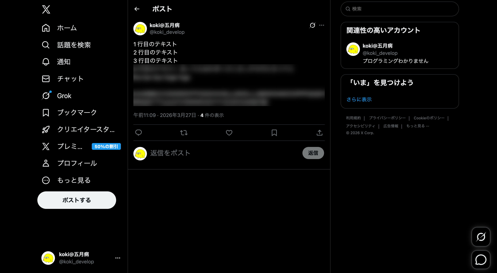

# 3 lines

Nobody reads past line 3 anyway.

A Chrome extension that blurs everything after the 3rd line on x.com posts.



## Development

```bash
pnpm install
pnpm dev
```

Load `build/chrome-mv3-dev` in `chrome://extensions` with developer mode enabled.

## Build

```bash
pnpm build
```

## License

[MIT](./LICENSE)
